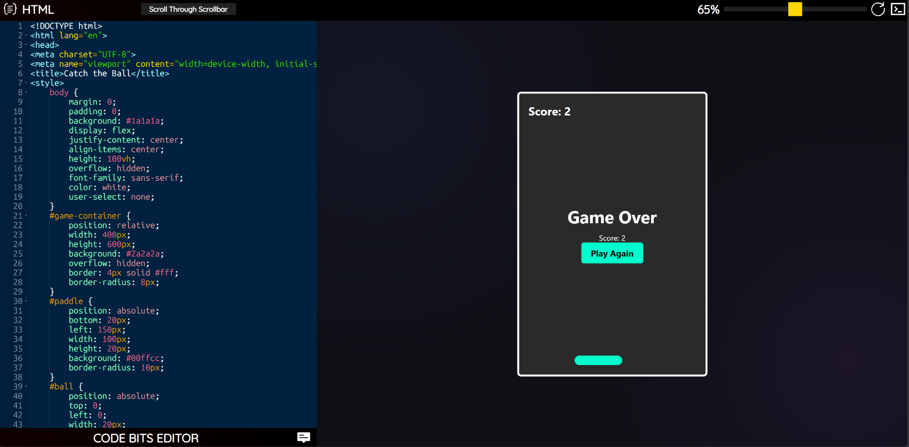
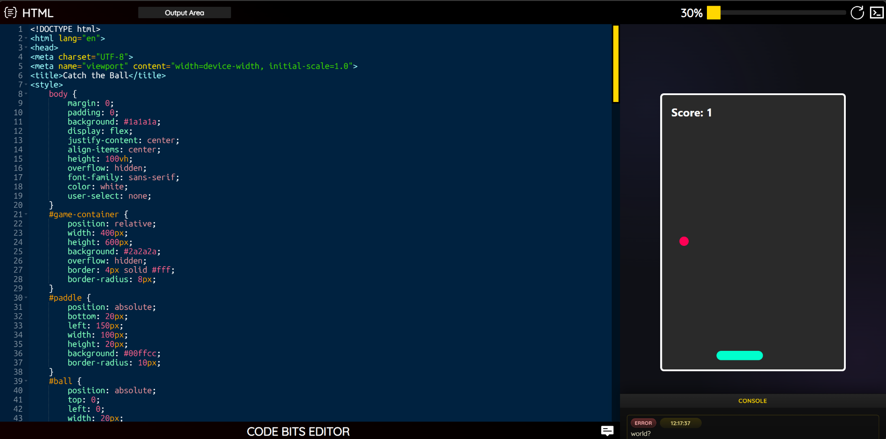
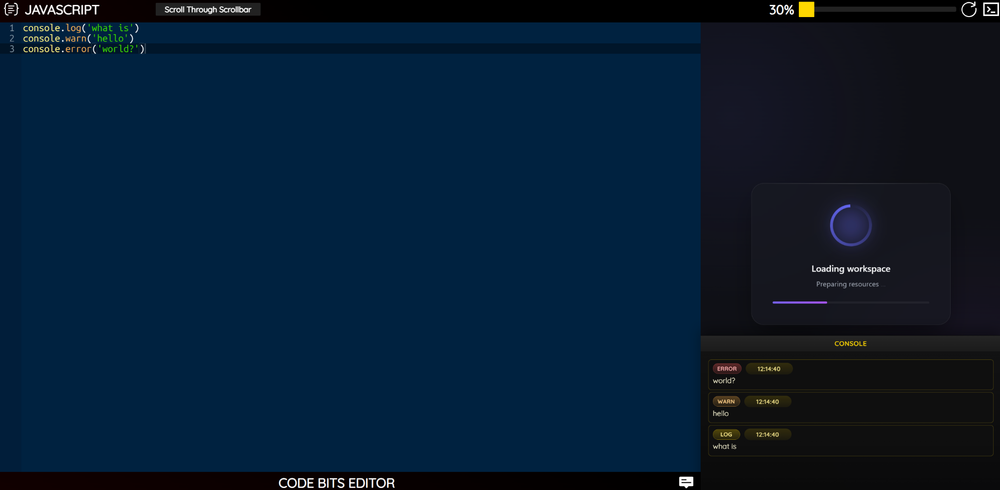
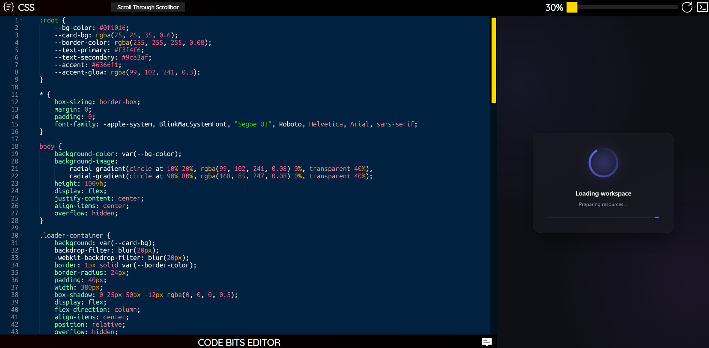
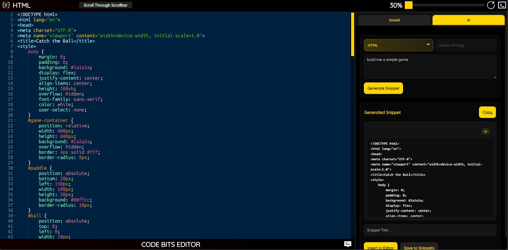
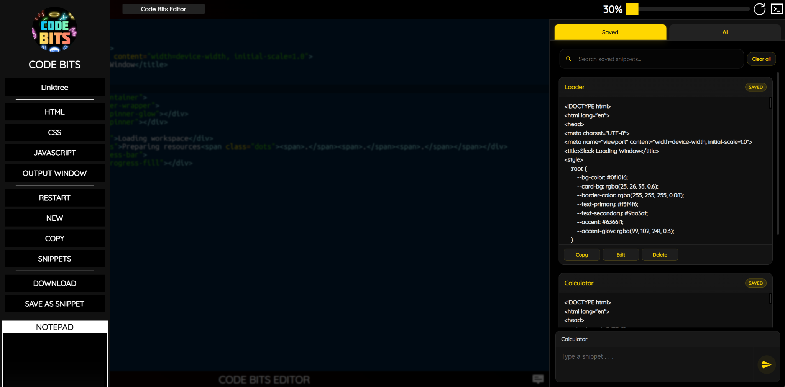
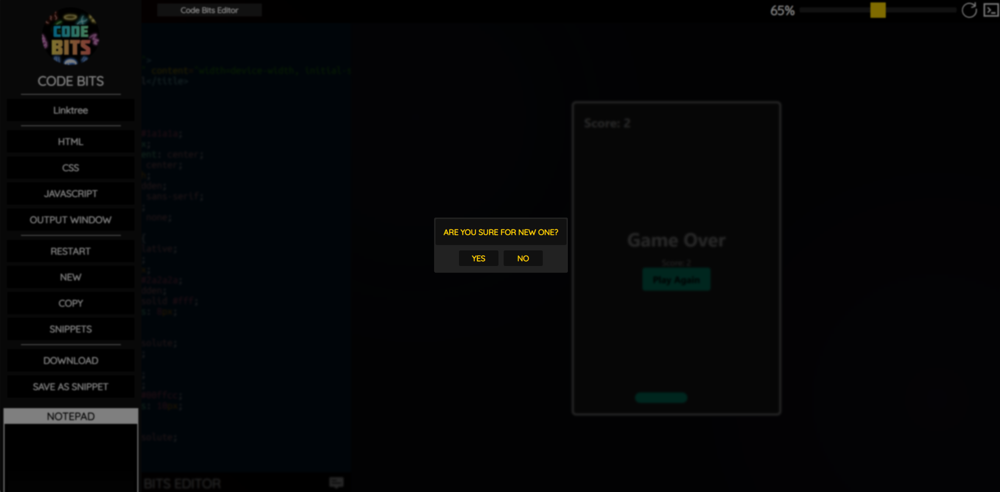

# Code Bits Editor

> A browser-based development environment for writing, previewing, and experimenting with **HTML, CSS, and JavaScript** — with an integrated console, reusable snippets, responsive workspace controls, and optional AI-assisted code generation.

🌐 **[Launch Code Bits Editor](https://code-bits-editor.vercel.app/)** ·
**[Astitva Srivastava | LinkedIn](https://www.linkedin.com/in/dev-astitva/)**

---

## Overview

**Code Bits Editor** is a personal browser-based development environment designed and built from scratch by **Astitva Srivastava**.

The goal is to make front-end experimentation quick and convenient without requiring a traditional local development setup for every small idea. The editor brings HTML, CSS, JavaScript, preview, console output, snippets, and optional AI assistance into one workspace.

The project is designed primarily as a client-side web experience, with supporting services used where necessary for features such as AI-assisted generation.

---

## Features

### 🧑‍💻 HTML, CSS & JavaScript Editing

Dedicated **Ace Editor** panes for:

- HTML
- CSS
- JavaScript

Each language can be switched from the interface while keeping the editing workflow in one workspace.

### ⚡ Interactive Preview

Run the current project directly in the browser and see the result alongside the editor.

The preview environment is designed for experimenting with complete front-end pages, including HTML structure, CSS styling, and JavaScript behavior.

### 🖥️ Responsive Workspace

Adjust the balance between the editor and preview area to focus on either coding or output.

The interface also adapts its workspace behavior for different screen sizes.

### 🖥️ Integrated Console

JavaScript output and runtime messages can be viewed directly inside Code Bits Editor through the built-in console.

This makes it possible to experiment with JavaScript without constantly switching to browser developer tools.

### 📝 Snippet Manager

Create a personal collection of reusable snippets.

The snippet workspace supports:

- Saving snippets
- Searching snippets
- Editing saved snippets
- Copying snippets
- Deleting snippets
- Saving complete projects as snippets

### 🤖 AI-Assisted Code Generation

An optional AI assistant helps generate HTML, CSS, or JavaScript from a natural-language description.

Generated code can be:

- Copied
- Inserted directly into the active editor
- Saved as a reusable snippet

### 💾 Local Persistence

Editor content and saved snippets are persisted in the browser so work can survive a page reload.

### 📦 Export & Output Tools

The application provides tools for working with the current project outside the editor, including:

- Copying the combined project code
- Downloading the project as an HTML file
- Opening the current project in a separate output window

### ⌨️ Keyboard Shortcuts

Common editor actions such as language switching, preview refresh, menu control, and copying can be accessed through keyboard shortcuts.

---

## Screenshots

> Place the screenshots below inside the `screenshots/` folder using the exact filenames shown.

### 1.png — Main Workspace

The primary Code Bits workspace showing the editor, application controls, preview area, and overall interface.

---

### 2.png — HTML + Live Preview

Show a meaningful HTML example running in the preview. Prefer a small but visually recognizable page rather than an empty document.

---

### 3.png — CSS Styling Workflow

Show the CSS editor with a clearly styled project visible in the preview. This screenshot should demonstrate that the editor is useful for real visual experimentation.

---

### 4.png — JavaScript + Console

Show JavaScript in the editor together with useful console output in Code Bits' integrated console.

A good example is a small interactive project that logs values, events, or results rather than displaying an error.

---

### 5.png — Snippet Manager

Show the Saved Snippets interface with several well-named snippets visible. The screenshot should make the save, search, and reusable-code workflow obvious.

---

### 6.png — AI Assistant

Show the AI tab generating a useful HTML/CSS/JavaScript snippet. Keep the prompt and generated result readable so the purpose of the feature is immediately clear.

---

### 7.png — Workspace / Output Workflow

Show a strong final-project workflow such as an expanded preview, adjusted editor/preview split, or the output window. Use this screenshot to demonstrate the flexibility of the workspace rather than repeating the main editor view.

---

## Technology

- **HTML5**
- **CSS3**
- **JavaScript**
- **Ace Editor**
- **Browser Local Storage**
- **Google Gemini** for optional AI-assisted generation
- **Vercel** for deployment

---

## How It Works

Code Bits Editor combines a few focused layers:

- **HTML** defines the application structure and interface.
- **CSS** controls the layout, visual design, responsive behavior, and overlays.
- **JavaScript** manages the editors, project state, persistence, snippets, preview workflow, console, shortcuts, and integrations.
- A dedicated preview environment is used for running the user's front-end project separately from the main editor experience.

The result is a single browser workspace for writing code, experimenting with it, and managing small reusable pieces of work.

---

## AI Assistant

The optional AI assistant is designed around a simple workflow:

1. Choose HTML, CSS, or JavaScript.
2. Describe what you want to build.
3. Generate a snippet.
4. Review the result.
5. Copy it, insert it into the editor, or save it for reuse.

The AI functionality is an enhancement to the editor rather than a requirement for using the core HTML/CSS/JavaScript workflow.

---

## Live Demo

Try the deployed application:

**[Launch Code Bits Editor](https://code-bits-editor.vercel.app/)**

The live deployment is primarily intended for demonstration and portfolio purposes.

---

## Public Repository

This repository is a **public project showcase**.

The complete source code, internal implementation details, deployment configuration, and private development infrastructure are intentionally not included here.

The repository is intended to document the project, demonstrate its capabilities, and provide a link to the deployed application.

---

## Developer

**Astitva Srivastava**

**[LinkedIn](https://www.linkedin.com/in/dev-astitva/)**

---

## License

All rights reserved.

The source code, design, implementation, assets, and underlying logic of Code Bits Editor are proprietary unless explicitly stated otherwise.

Unauthorized copying, redistribution, modification, or reproduction of the project is not permitted.
