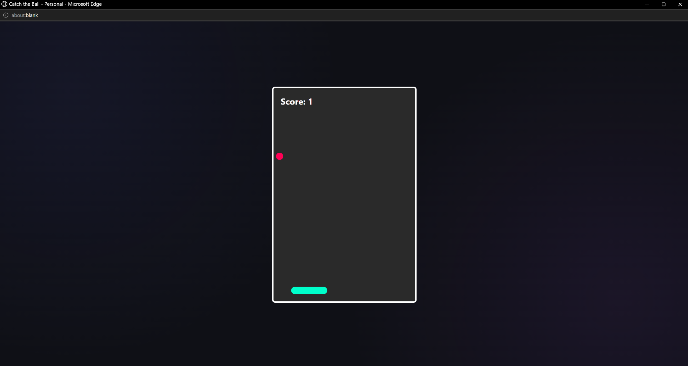
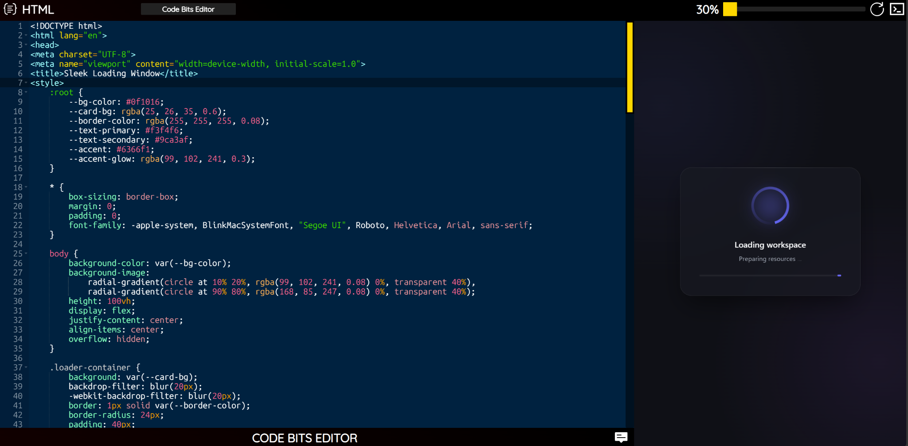
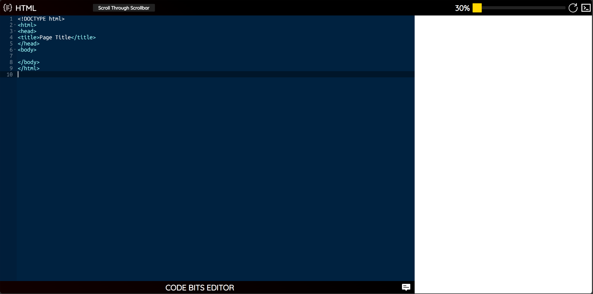
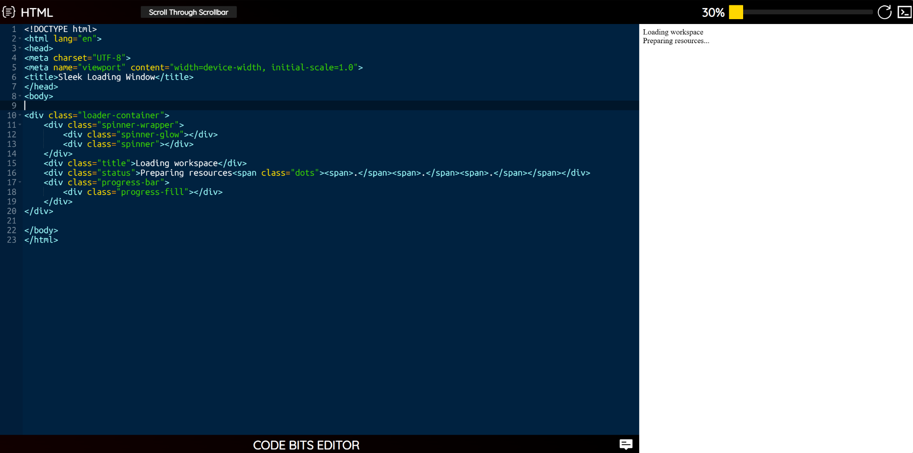

# Code Bits Editor

> A browser-based development environment for writing, previewing, and experimenting with **HTML, CSS, and JavaScript** — with an integrated console, reusable snippets, responsive workspace controls, and optional AI-assisted code generation.

🌐 **[Launch Code Bits Editor](https://code-bits-editor.vercel.app/)** ·
**[Astitva Srivastava | LinkedIn](https://www.linkedin.com/in/dev-astitva/)**

---

## Overview

**Code Bits Editor** is a personal browser-based development environment designed and built from scratch by **Astitva Srivastava**.

It brings HTML, CSS, JavaScript, live preview, console output, snippets, export tools, and optional AI assistance into a single workspace for rapid front-end experimentation.

The project is designed to make it easy to move from an idea to a working browser-based prototype without constantly switching between separate tools.

---

## Features

### 🧑‍💻 HTML, CSS & JavaScript Editing

Dedicated **Ace Editor** panes for:

- HTML
- CSS
- JavaScript

Switch between languages from the interface while keeping the entire project in one workspace.

### ⚡ Interactive Preview

Run your current front-end project directly in the browser and view the result alongside the editor.

The preview workflow supports complete HTML documents, styling, and JavaScript-driven interactions.

### 🖥️ Responsive Workspace

Adjust the editor/preview balance to give more space to coding or output depending on the task.

The interface also includes screen-size handling for the overall workspace.

### 🖥️ Integrated Console

View JavaScript logs, warnings, errors, and runtime messages directly inside Code Bits Editor without relying entirely on browser developer tools.

### 📝 Snippet Manager

Build a personal collection of reusable code.

The snippet workflow supports:

- Saving snippets
- Searching snippets
- Editing saved snippets
- Copying snippets
- Deleting snippets
- Saving project code as a snippet

### 🤖 AI-Assisted Code Generation

An optional AI assistant can generate HTML, CSS, or JavaScript from a natural-language description.

Generated code can be:

- Copied
- Inserted into the editor
- Saved as a reusable snippet

### 💾 Local Persistence

Editor content and saved snippets persist locally in the browser, allowing work to survive a page refresh.

### 📦 Export & Output Tools

Work with the current project outside the editor through:

- Copying the combined project
- Downloading an HTML file
- Opening the project in an output window

### ⌨️ Keyboard Shortcuts

Common actions such as language switching, preview refresh, menu control, and copying are available through keyboard shortcuts.

---

## Screenshots

The screenshots below are arranged to show the editor as a complete workflow: **write → preview → debug → style → generate → save → manage → export**.

### 1.png — Main Workspace

The core Code Bits workspace with the code editor, preview area, adjustable workspace split, and application chrome visible together.

### 2.png — Preview & Integrated Console

A compact editor/preview layout showing the rendered project together with the integrated console for inspecting runtime output.

### 3.png — JavaScript & Console

The JavaScript editor with `console.log`, `console.warn`, and `console.error` output appearing directly inside the Code Bits console.

### 4.png — CSS Styling Workflow

The CSS editing workflow, demonstrating syntax highlighting and live project styling alongside the output area.

### 5.png — AI Assistant

The AI workspace showing a natural-language request and a generated snippet that can be reviewed, copied, inserted, or saved.

### 6.png — Snippet Manager

The reusable snippet workspace with saved code, search, and snippet actions.

### 7.png — Workspace Controls & New Project

The side menu and project controls, including language navigation, output tools, creating a new project, snippets, download, and other workspace actions.

### 8.png — Output Window

A generated project opened as a standalone output window, demonstrating how a project can be viewed separately from the main editor workspace.

### 9.png — Workspace Loading Experience

The Code Bits demo project loading screen, showing the application's startup experience (made using AI via the integrated-AI feature on snippet panel).

### 10.png — Starter Project

The clean starter workspace with the default HTML structure and an empty preview, showing the starting point for a new project.

### 11.png — Custom Loading Interface

---

## Technology

- **HTML5**
- **CSS3**
- **JavaScript**
- **Ace Editor**
- **Browser Local Storage**
- **Google Gemini** for optional AI-assisted generation
- **Vercel** for deployment

---

## How It Works

Code Bits Editor combines several focused parts into one browser workspace:

- **HTML** provides the application structure.
- **CSS** controls layout, visual styling, responsive behavior, and overlays.
- **JavaScript** manages editor state, persistence, preview execution, console output, snippets, shortcuts, and integrations.
- Supporting services are used where necessary for features such as AI-assisted generation.

The result is a lightweight environment for experimenting with front-end ideas and turning them into working browser experiences.

---

## AI Assistant

The optional AI assistant follows a simple workflow:

1. Choose HTML, CSS, or JavaScript.
2. Describe the desired functionality.
3. Generate code.
4. Review the generated result.
5. Copy it, insert it into the editor, or save it as a snippet.

The AI feature is optional; the core HTML/CSS/JavaScript editor works independently of it.

---

## Live Demo

Try the deployed application:

**[Launch Code Bits Editor](https://code-bits-editor.vercel.app/)**

The live deployment is provided primarily for demonstration and portfolio purposes.

---

## Public Repository

This repository is a **public project showcase**.

The complete source code, private implementation details, internal development infrastructure, and deployment configuration are intentionally not included here.

The public repository is intended to document the project, demonstrate its capabilities, and provide access to the deployed application.

---

## Developer

**Astitva Srivastava**

**[LinkedIn](https://www.linkedin.com/in/dev-astitva/)**

---

## License

All rights reserved.

The source code, design, implementation, assets, and underlying logic of Code Bits Editor are proprietary unless explicitly stated otherwise.

Unauthorized copying, redistribution, modification, or reproduction of the project is not permitted.
